# NoteWave

NoteWave allows users to create, view, edit, and delete notes from their personalized account. It provides a platform to organize and store important information, thoughts, and ideas in a secure and convenient manner. Users can easily access their notes from any device with internet access. The application is designed to be user-friendly, providing a simple and intuitive interface for efficient note-taking and management.

Developed as part of a milestone project 3 for Code Institute.

  

[View the deployed website here](https://notewave.herokuapp.com/)

## Table of contents

* [`User Experience`](#user-experience-ux)
  * [`User Stories`](#user-stories)

* [`Design`](#design)
  * [`Colour Scheme`](#colour-scheme)
  * [`Typography`](#typography)
  * [`Imagery`](#imagery)
  * [`Wireframes`](#wireframes)
  * [`Features`](#features)
    * [`Desktop`](#desktop)
    * [`Mobile`](#mobile)
    * [`Future Implementations`](#future-implementations)
  * [`Accessibility`](#accessibility)

* [`Technologies Used`](#technology)
  * [`Languages Used`](#languages-used)
  * [`Frameworks, Libraries & Programs Used`](#frameworks--programs-used)

* [`Deployment & Local Development`](#deployment--local-development)
  * [`Deployment`](#deployment)
  * [`Local Development`](#local-development)
    * [`How to Fork`](#how-to-fork)
    * [`How to Clone`](#how-to-clone)

* [`Testing`](#testing)
  * [`Fixed Bugs`](#fixed-bugs)
  
* [`Credits`](#credits)
  * [`Code Used`](#code-credits)
  * [`Acknowledgments`](#acknowledgements)

## User Experience (UX)

### Key information for the site

1. Users can create a unique account to securely store their notes.
2. The app allows users to create, view, edit, and delete their notes at any time.
3. Notes are sorted by default from the newest created to the oldest.
4. The app is accessible on multiple devices and platforms, allowing users to access their notes on-the-go.
5. The app consists of social media links where users can follow or contact the developer.

### User Stories

1. First-time user: As a first time user, I want to easily create a new account on the note app, so I can start creating, viewing, editing, and deleting notes. I also want to be able to quickly and intuitively navigate through the note app, so I can easily find the features I need to use and efficiently manage my notes.

2. Frequent user: As a frequent user, I want to be able to easily access my notes from my previous sessions so that I can quickly pick up where I left off and continue my work. I also want to be able to edit, delete, and create new notes when I wish to do so.

### User Goals

#### Client goals

1. Provide a reliable and user-friendly note-taking app for their customers.
2. Increase customer engagement and satisfaction with the app by adding different features and improving the UI, leading to increased retention and loyalty.
3. Expand the user base by marketing the app effectively to new potential customers.

- - -

## Design

### Colour Scheme

* Linen **(#FFF1E5)** is the main color used as a background of the page. Incorporated from the Financial Times website, this font creates a subtle and calming effect on the eyes of the reader, making it easier to read and process the content on the website. Additionally, the use of Linen as a background color provides a clean and sophisticated look to the overall design, which aligns with the Financial Times' brand image.

* Night **(#111)** is used in both forms for labels, titles, inputs, and the login/sign up buttons. It is also used for add note button and footer background. Night it is a dark color that provides a strong contrast against the light Linen background, making it easy to distinguish and navigate through different sections of the website. Moreover, the use of Night as the primary accent color on the website creates a bold and modern look, which enhances the visual appeal of the overall design.

* Seashell **(#FFF8F1)** is used as an alternative to white (#FFF) color for several elements on the page. It has a warmer and more natural tone than pure white, creating a softer and more inviting look for the website.

* French Gray **(#CACDD2)** is used for navbar links, footer text (p) and copyright text. because it is a muted and subtle color that provides a clear visual contrast against the Night (#111) background while still being easy on the eyes.

* Savoy Blue **(#5264AE)** is used for hover state, edit button, title field (focus & valid), and social media icons.

  * 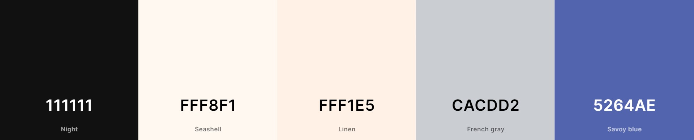

### Typography

Google Fonts was used throughout the whole page:

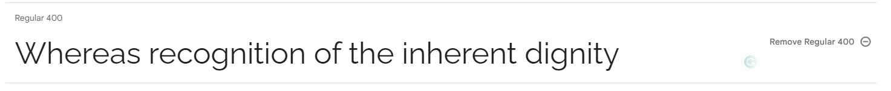

* **Raleway** font was used because it has a modern and professional look, making it suitable for a note-taking app that aims to provide a clean and polished user interface while ensuring that the text is easily readable. Additionally, it has a wide range of font weights and styles available, making it versatile for various design elements within the app.

### imagery

This website has no images present.

### Wireframes

* **Desktop** - Home

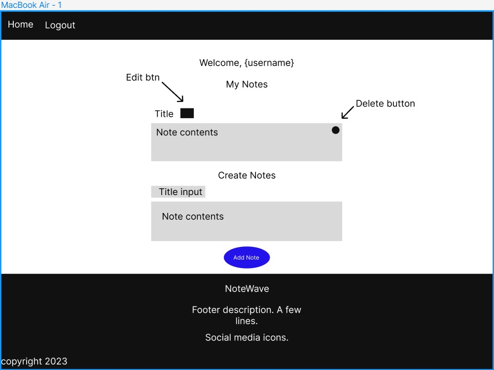

* **Desktop** - Edit

* **Desktop** - Sign Up

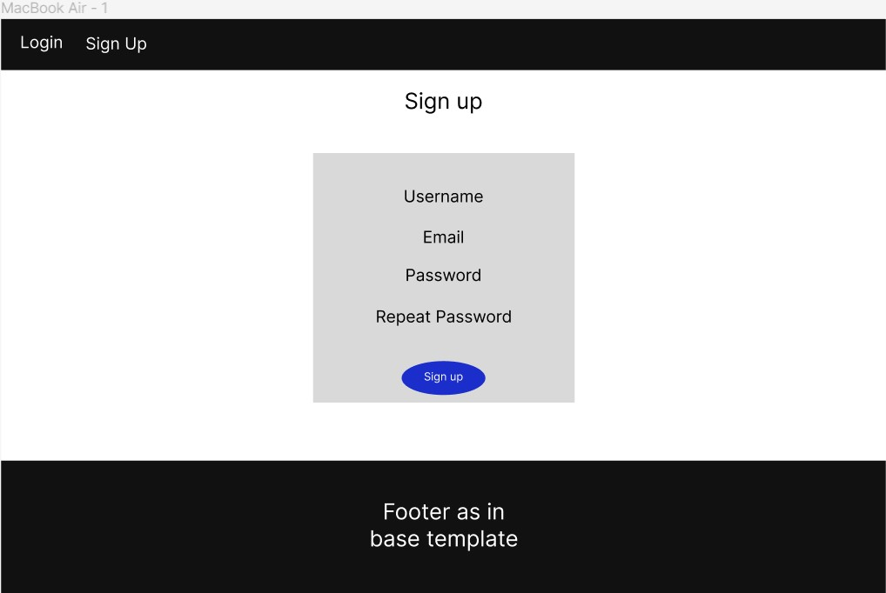

* **Desktop** - Login

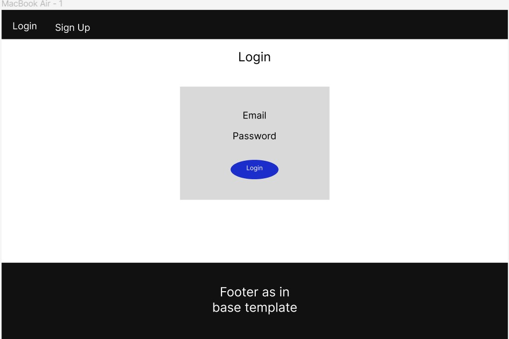

* **Mobile** - Home

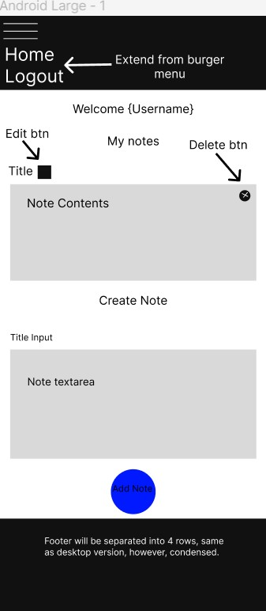

* **Mobile** - Edit

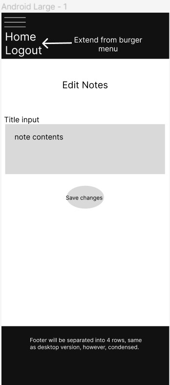

* **Mobile** - Sign Up

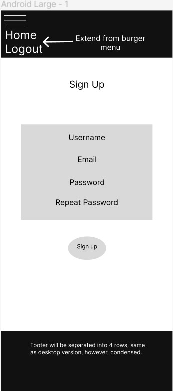

* **Mobile** - Login

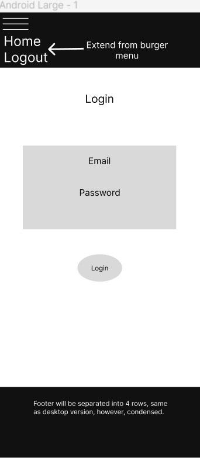

## Features

The page consists of the base template, home, edit_note, login, sign_up, and 404 pages where all features and content are present & responsive.

### Desktop

* The browser tab & favicon:

  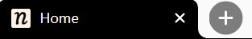

* The Navbar:

  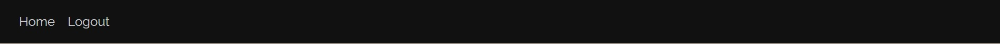

* Created note:

  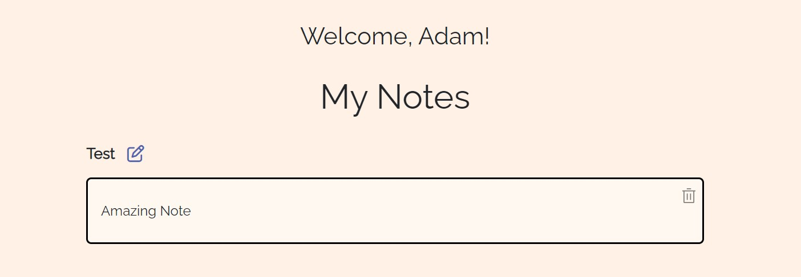

* Add note:

  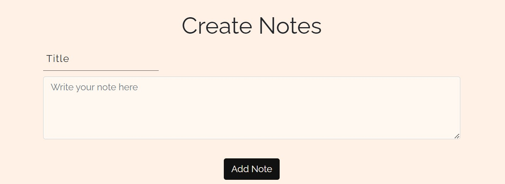

* Footer:

  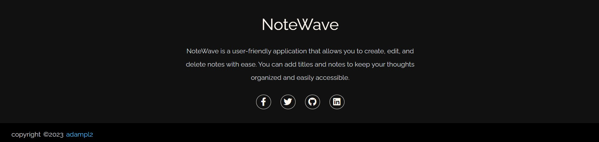

* Edit note:

  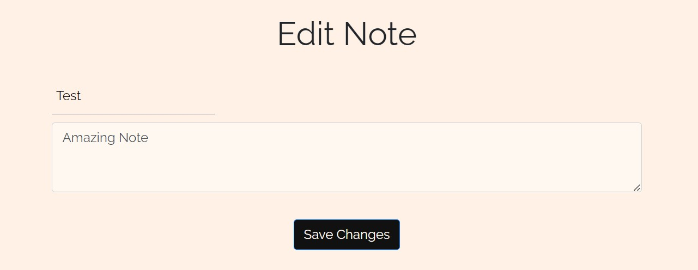

* Login:

  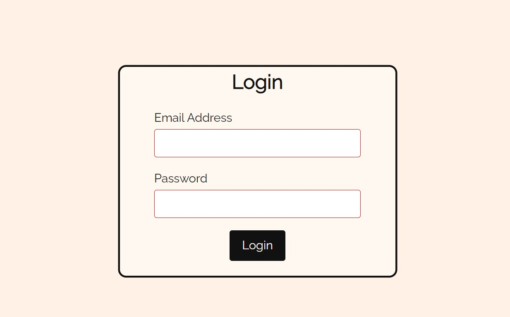

* Sing Up:

  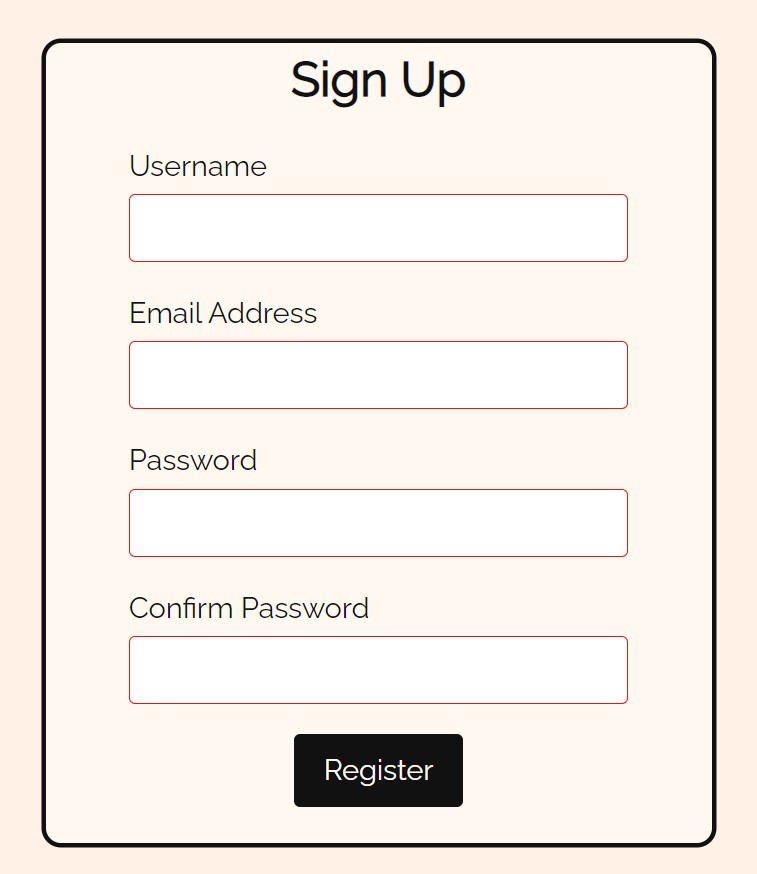

### Mobile

* Navbar + Created note:

  

* Create Note + Footer:

  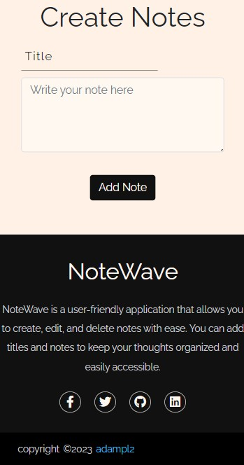

* Edit:

  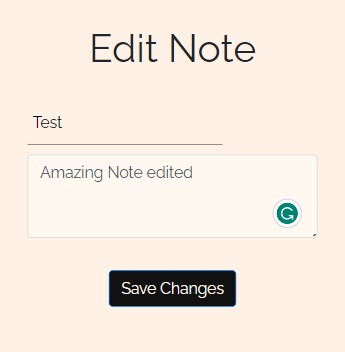

* Login:

  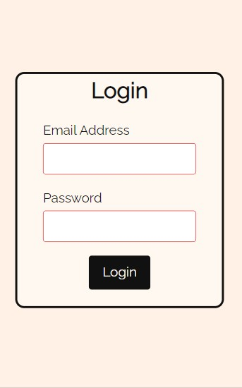

* Sign Up:

  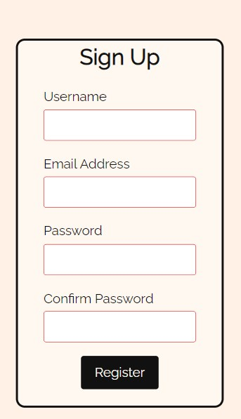

### Future Implementations

1. Create `Forgot Password` option for users when logging in if the password is forgotten by the user or a password reset is intended.

2. Ability to sort notes based on importance.

3. Ability to customize notes, e.g. using colours.

4. Back to top button.

5. Voice-to-text functionality, allowing users to dictate their notes using their device's microphone.

6. Offline mode, allowing users to access their notes even when they don't have an internet connection.

7. Ability to delete user account permanently.

### Accessibility

It was ensured that the website is accessible and as user-friendly as possible. I have achieved this by:

* Using semantic HTML.
* Following heading hierarchy.
* Implementing *Tab* friendly navigation for links.
* Using hover effects on all buttons and links to inform the user they are hovering on a button.
* Complying with colour contrast guidelines (Aa).

- - -

## Technology

### Languages Used

 HTML, CSS, JavaScript, and Python were used for this project.

### Frameworks & Programs Used

* [Flask](https://flask.palletsprojects.com/en/2.2.x/) User as a base for development.

* [jQuery](https://jquery.com/) As JavaScript library.

* [Jinja](https://jinja.palletsprojects.com/en/3.1.x/) As template engine.

* [SQLAlchemy](https://www.sqlalchemy.org/) For designing and managing database.

* [ElephantSQL](https://www.elephantsql.com/) Manage database.

* [Figma](https://www.figma.com/) For wireframes.

* [Git](https://git-scm.com/) As version control.

* [GitHub](https://github.com/) To save and store the files for the website.

* [GitPod](https://gitpod.io) IDE used to create the site.

* [Heroku](https://heroku.com) For deployment.

* [Google Fonts](https://fonts.google.com/) To import the fonts used on the website.

* [Bootstrap](https://getbootstrap.com/) For style.

* [Font Awesome](https://fontawesome.com/) For the iconography on the website.

* [Google Dev Tools](https://developer.chrome.com/docs/devtools/) For troubleshooting, testing features and solving issues with responsiveness and styling.

* [Coolors](https://coolors.co/) To generate colour palette.

* [Am I Responsive?](http://ami.responsivedesign.is/) To show the website image on a range of devices.

* [Favicon.io](https://favicon.io/) To create favicon.

* [uiverse](https://uiverse.io/) UI elements.

- - -

## Testing

Please refer to [TESTING.md](TESTING.md) file for full testing procedure.

### Fixed Bugs

1. When creating a note, there is a minimum number of characters required to create it. However, when editing the note, I noticed I was able to remove all contents from note title and description with no errors. This was later fixed to match create note requirements.

2. The after pseudo element in the delete button did not appear fully when hovered. This was fixed by adding z-index of 0 and specifying note container's position as relative.

3. Favicon not rendering. This was fixed by moving the favicon files to the static directory.

4. When trying to sort the notes from the newest created to the oldest using filter_by and order_by methods, I encountered a bug which prevented the notes from sorting accordingly. This issue was later fixed by looping in reverse `([::-1])` in the HTML template.

- - -

## Deployment & Local Development

### Deployment

GitHub Pages was used to deploy the live [adampl12/]() website. Instructions:

1. Log in (or sign up) to Github.
2. Find the repository for this project, [adampl12/]().
3. Click on the Settings link.
4. Click on the Pages link in the left-hand side navigation bar.
5. In the Source section, choose main from the drop-down select branch menu. Select Root from the drop-down select folder menu.
6. Click Save. Your live Github Pages site is now deployed at the URL shown.

### Local Development

#### How to Fork

Fork the CryptoSwap repository:

1. Log in (or sign up) to Github.
2. Go to the repository for this project, [adampl12/]().
3. Click the Fork button in the top right corner.

#### How to Clone

Clone the CryptoSwap repository:

1. Log in (or sign up) to GitHub.
2. Go to the repository for this project, [adampl12/]().
3. Click on the code button, select whether you would like to clone with HTTPS, SSH or GitHub CLI and copy the link shown.
4. Open the terminal in your code editor and change the current working directory to the location you want to use for the cloned directory.
5. Type 'git clone' into the terminal and then paste the link you copied in step 3. Press enter.

#### Running the Project

1. Once located in the CryptoSwap repository, click on the green gitpod button located on the right-hand side of the screen.
2. Once workspace opens, enter `python3 run.py` command in the terminal.
3. A pop-up window will appear. Click on "Make Public" to expose the server on a public URL.
4. Open a new browser window and navigate to the URL provided by Gitpod to view the website.
5. Use the website as intended and ensure that all features are functioning correctly.

- - -

## Credits

### Code Credits

* [Tech With Tim](https://www.youtube.com/watch?v=dam0GPOAvVI) - Flask, Authentication & Databases.
* [Yaya12085](https://uiverse.io/Yaya12085/horrible-grasshopper-43) - Sign Up form.
* [Foolish Developer](https://foolishdeveloper.com/simple-responsive-footer-design-using-html-and-css/) - Footer.
* [Munim Munna](https://stackoverflow.com/questions/31176402/how-to-hide-flash-message-after-few-seconds) - JQuery function to hide flash message automatically.
* [boryanakrasteva](https://uiverse.io/boryanakrasteva/tidy-falcon-17) - Delete note button.
* [30secondsofcode](https://www.30secondsofcode.org/css/s/hover-underline-animation/) - Navbar links.
* [AbanoubMagdy1](https://uiverse.io/AbanoubMagdy1/afraid-yak-99) - Add Title input.

- - -

## Acknowledgements

* [Rohit Sharma](https://github.com/rohit0286) - My Code Institute mentor.